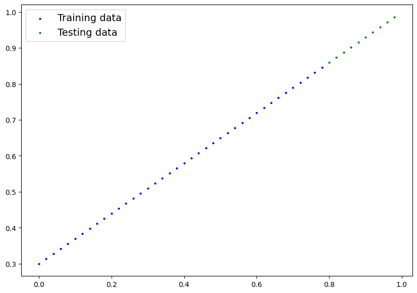
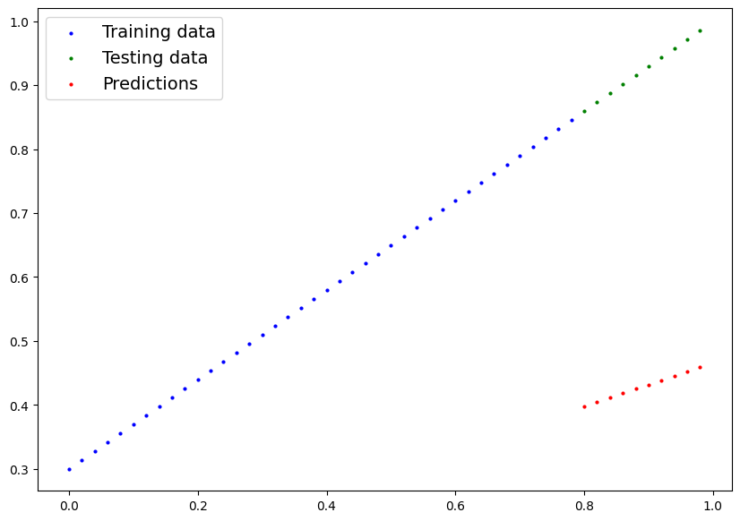
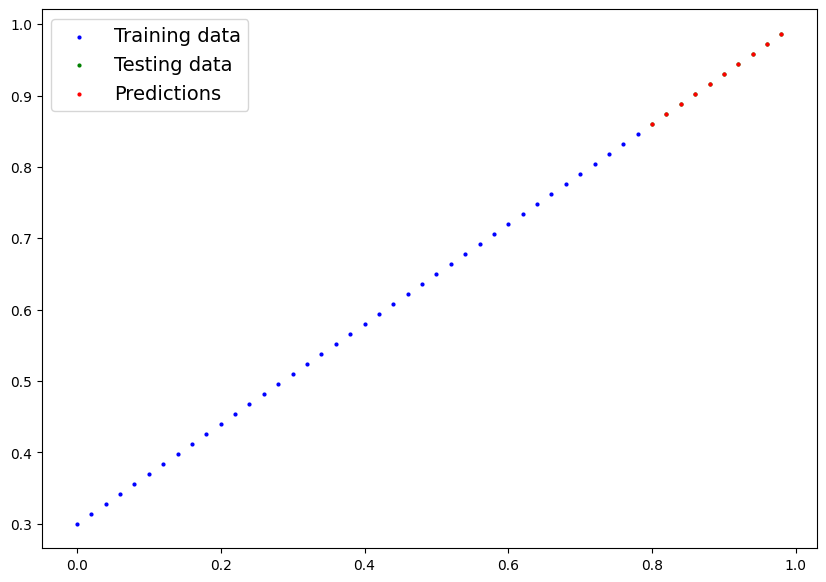
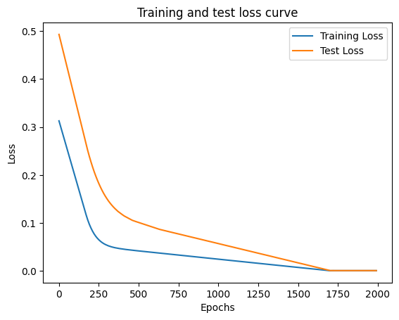

# My First PyTorch Model

This repository contains my first implementation of a machine learning model using PyTorch. I've built a linear regression model that learns to predict values based on the relationship y = weight * x + bias.

## Project Visualization

The following visualizations show the progression of my model:

### Initial Data Split

*Figure 1: Data split into training (blue) and testing (green) sets.*

### Initial Predictions

*Figure 1: Initial model predictions (red) before training compared to testing data (green).*

### Trained Model Predictions

*Figure 3: Model predictions (red) after training, now closely aligned with the testing data (green).*

## Training Progress
The following graph shows how the model's loss decreased during training:

*Figure 4: Training loss (blue) and test loss (orange) decreasing over epochs, demonstrating the model's learning progress.*

## What I've Learned

Through this project, I've gained hands-on experience with:

- Creating and manipulating PyTorch tensors
- Building a custom model by subclassing nn.Module
- Implementing a complete training loop with forward and backward passes
- Using optimizers to update model parameters through gradient descent
- Evaluating model performance on test data
- Visualizing predictions against actual values

## Project Structure

The code demonstrates a complete PyTorch workflow:

1. **Data Preparation**: Creating synthetic data with known parameters (weight=0.7, bias=0.3)
2. **Model Building**: Implementing a custom LinearRegressionModel class
3. **Model Training**: Setting up loss function, optimizer, and training loop
4. **Evaluation**: Comparing model predictions to actual values

## Results

My model successfully learned parameters close to the original values:
- Original parameters: weight=0.7, bias=0.3
- Learned parameters: weight≈0.7, bias≈0.3

As the visualizations show, the trained model's predictions align closely with the actual test data.

## Requirements

- Python 3.6+
- PyTorch
- Matplotlib

## Running the Code

```bash
python pytorch_linear_regression.py
```

## Next Steps

As I continue learning, I plan to:
- Explore more complex models
- Work with real-world datasets
- Implement different optimization algorithms
- Add regularization techniques
